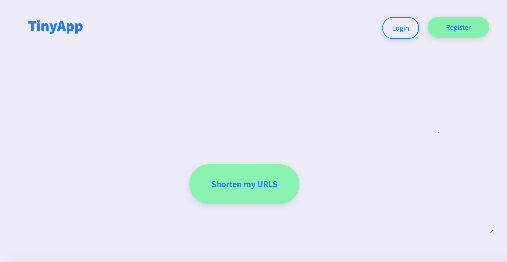
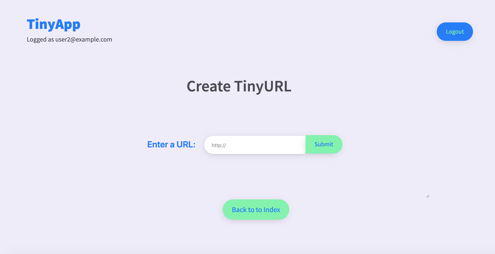

# Tiny App

Tiny App is a full stack web application built with Node and Express to allow uses to shorten their urls.

# Final project screenshots

### Dependencies

    - bcrypt": "2.0.0",
    - body-parser": "^1.18.3",
    - cookie-parser": "^1.4.4",
    - cookie-session": "^2.0.0-beta.3",
    - crypto-js": "^3.1.9-1",
    - ejs": "^2.6.1",
    - express": "^4.16.4"
